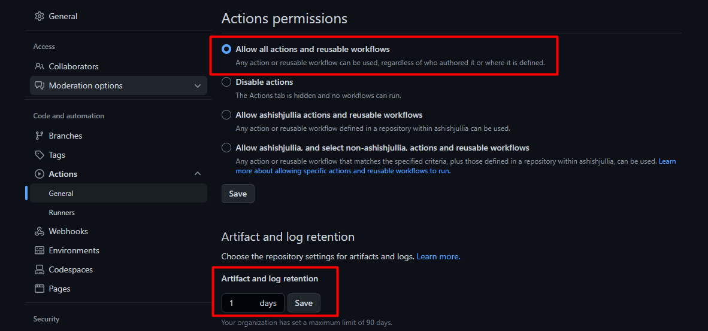
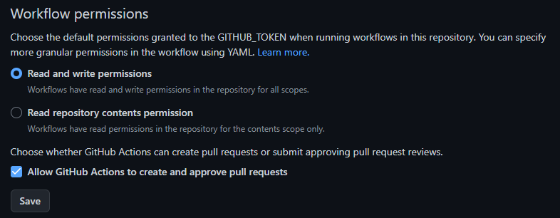

### Terraform with Rollback Mechanism using GitHub Actions (Generic Solution)
> **Note**: I tested this on **AWS** only as of  now.

By default there is no such rollback option or mechanism available in terraform (atm of writing this).

So, in order to adapt terraform to my usual tasks I never found myself comfortable in using it in production but not anymore, I decided to leverage the functionality of GitHub Actions along with S3 bucket, DynamoDB Table and GitHub Releases.

#### **Step 1**: Make sure to create an IAM User and attach the following policy to it

Below is the minimum required permissions (IAM policy) for the IAM user configured for the `GitHub Actions User` in order to initialize/setup/create terraform s3 backend.

Before using the policy below, make sure to substitute `<bucket-name>` and `<dynamodb-table-name>` as per your needs.

```json
{
    "Version": "2012-10-17",
    "Statement": [
        {
            "Sid": "S3SpecificAndGeneric",
            "Effect": "Allow",
            "Action": [
                "s3:GetLifecycleConfiguration",
                "s3:GetBucketTagging",
                "s3:GetBucketLogging",
                "s3:CreateBucket",
                "s3:ListBucket",
                "s3:GetAccelerateConfiguration",
                "s3:GetBucketPolicy",
                "s3:GetBucketObjectLockConfiguration",
                "s3:GetEncryptionConfiguration",
                "s3:PutBucketTagging",
                "s3:GetBucketRequestPayment",
                "s3:PutBucketAcl",
                "s3:DeleteBucket",
                "s3:PutBucketVersioning",
                "s3:GetBucketPublicAccessBlock",
                "s3:PutBucketPublicAccessBlock",
                "s3:GetBucketWebsite",
                "s3:GetBucketVersioning",
                "s3:GetBucketAcl",
                "s3:GetReplicationConfiguration",
                "s3:GetBucketCORS",
                "s3:PutEncryptionConfiguration",
                "s3:GetObject",
                "s3:PutObject",
                "s3:DeleteObject"
            ],
            "Resource": [
                "arn:aws:s3:::<bucket-name>",
                "arn:aws:s3:::<bucket-name>/*"
            ]
        },
        {
            "Sid": "DynamoDBSpecificTable",
            "Effect": "Allow",
            "Action": [
                "dynamodb:GetItem",
                "dynamodb:DescribeTable",
                "dynamodb:PutItem",
                "dynamodb:DeleteItem",
                "dynamodb:CreateTable",
                "dynamodb:TagResource"
            ],
            "Resource": [
                "arn:aws:dynamodb:*:*:table/<dynamodb-table-name>"
            ]
        },
        {
            "Sid": "DynamoDBGeneric",
            "Effect": "Allow",
            "Action": [
                "dynamodb:ListTables"
            ],
            "Resource": [
                "arn:aws:dynamodb:*:*:table/*"
            ]
        },
        {
            "Sid": "S3Generic",
            "Effect": "Allow",
            "Action": [
                "s3:ListAllMyBuckets"
            ],
            "Resource": "*"
        }
    ]
}

```

After creating the user with above permissions/policy create `github repo secrets` under the following names (or you can choose on your own but make sure to replace their references in `.yml` files).


Official policy suggestion by the terraform (HashiCorp) on their website for the `S3 Backend` are:
- [for S3 Bucket](https://developer.hashicorp.com/terraform/language/settings/backends/s3#s3-bucket-permissions "for s3 bucket")
- [for DynamoDB Table](https://developer.hashicorp.com/terraform/language/settings/backends/s3#dynamodb-table-permissions "for DynamoDB Table")

But as you can see that I've added more permissions to it because in the GitHub Actions we are checking inside `deploy-dev.yml` inside/under the job `initialize-tf-backend-if-does-not-exists` that whether the backend already exists or not, if not create one and set it for the provided terraform code.

> **Note**: S3 bucket (or specifically the key/directory/folder) the DynamoDB table will not get deleted even after `terraform destroy` as that will be created by `aws cli` and not with the `terraform code`, so it will be out of context of terraform (this was intentional for this mechanism).

> **Note** Even if we want to deploy/create `S3 backend` this with terraform code, there will always a [chicken-egg problem mentioned here](https://mmatecki.medium.com/terraform-chicken-egg-problem-7504f8ddf2fc). 

Apart from this^ policy whatever you perform/create `resources` in your AWS account, you have to add more permissions/policies to your the IAM user configured for the gh actions.

#### **Step 2**: In order to use this mechanism with your tf code, make sure you have the following files before you start writing your `.tf` files (get these from this repository - feel free to clone `git clone https://github.com/ashishjullia/terraform-w-rollback.git`)

```bash
├── .auto.tfvars
├── .github
│   └── workflows
│       ├── deploy-dev-rollback.yml
│       ├── deploy-dev.yml
│       ├── destroy-dev.yml
│       ├── prepare-rollback.yml
│       └── remove-artifacts.yml
├── .gitignore
├── .terraform-version
├── backend.tf
├── provider.tf
├── variables.tf
```
##### **2.1**: Populate the values for the following variables under


```
  AWS_REGION
  TF_STATE_BUCKET_NAME
  TF_STATE_DYNAMODB_TABLE_NAME
```
##### **2.2**: Create two `environments` under


These^ are actually two job names specified in `./.github/workflows/prepare-rollback.yml` and `./.github/workflows/deploy-dev-rollback.yml`

Whenever these two jobs will start to execute (depending upon the conditions i.e. whenever the conditions `pass`) `approvers` from the following list will get an email regarding the same. For more details on the approval time window - [follow](https://docs.github.com/en/actions/managing-workflow-runs/reviewing-deployments#about-required-reviews-in-workflows).


Also^, make sure to set/assign approvers for both of these environments (you can also choose yourself as an approver).

> **Note**: Make these two environments (with approvers) with the same names speicified as `prepare-rollback` and `rollback`. Because those are the strings specified in `./.github/workflows/prepare-rollback.yml` and `./.github/workflows/deploy-dev-rollback.yml`

##### **2.3**: Make sure you have following permissions set for Github Actions on targetted repo.





##### **2.4**: Create a branch and then create a pull request from it on GitHub and push further changes to that PR (for every commit/push you'll see a new generated plan in the same PR on GitHub and also a newly generated `README.md` file)
##### **2.5**: Populate the values for the variables specified in `./.auto.tfvars`
For this, make sure that the variables are defined in `./variables.tf` and then their values should be populated under `./.auto.tfvars`

##### **2.6**: If you want to add more resources, create their relevant `.tf` files under the root of this repo's dir structure context

##### **2.7**: Populate the `./.terraform-version` file with the terraform version you want to create your resources with
> **Note**: I would suggest to use [tfenv](https://github.com/tfutils/tfenv) in order to test things in your local environment.


#### **Step 4**: Push the changes (Make sure you are not on the `main`/`master` branch and on the relevant PR branch - active development)
```bash
git add .
git commit -m "message"
git push
```

After putting everything in place until `Step 2.2`, you can proceed with the following steps.

### How to deploy?

In order to work with this mechanism, make sure to follow the following `git` and `github`  workflow in the exact number of steps:

> **Important**: Make sure not to merge more than 1 branches/PRs at the same time, 1 deployment at a time - to avoid worst case scenarios

**Step 1**: Add your `.tf` files populated with relevant resources on a new branch and push it

**Step 2**: Create a `pull request` from that branch
- This will trigger the `initialize-tf-backend-if-does-not-exists` 1st and then `check-tf-code-and-create-plan-and-update-pr` jobs from `.github/workflows/deploy-dev.yml` workflow.

**Step 3**: Wait for these^ jobs to finish and stay on the active pull request page on GitHub
- As a result of completion of above^ mentioned jobs, there will be updates in:   
    - `tfplan` - you will see the the generated `tfplan` on the same pull request page as a comment - click on the `Show Plan` - to view the exact changes to be made to currently (if it is) deployed resources regarding additions/modifications/deletions

    - Updated or newly generated `README.md` file - it will be seen as a commit under


**Step 4**: Make sure to add `reviewers` to this PR

**Step 5**: Tightly observe the changes to the `generated tfplan`

> **Note**: Sometimes, even if we rely on such (this one) mechanism it is always good to see through things to make sure whether it makes sense or not.

**Step 6**: If everything seems correct - `Merge the PR`
- This will trigger the (again) `initialize-tf-backend-if-does-not-exists` 1st and then `deploy-to-dev` jobs from `.github/workflows/deploy-dev.yml` workflow.
- If after the step `Terraform Apply` with `id: apply` from the job `deploy-to-dev` return a `success` - then we are good to go for next pull request(s)

> **Worst Case Scenario**: If after the step `Terraform Apply` with `id: apply` from the job `deploy-to-dev` return a `failure`, then the following steps needs to be taken care of.

> ROLLBACK TIME

**Step 7**: If `Step 6` results in `failure`, we have 2 cases
- One, if it is the intial deployment (i.e nothing was deployed before it) then a complete destroy will take place under the step `Destroy is apply==failure and 0 releases` from the job `deploy-to-dev`
- Second, otherwise - it will trigger the `./github/workflows/prepare-rollback.yml` and as a result
    - An email will be sent to the reviewers specified under the `prepare-rollback` environment 
    - Workflow will be paused/wait until a the request is approved/rejected by the approvers/reviewers
    - If a request is `rejected` - workflow will `exit`
    - If a request is `approved` - workflow will proceed with further defined steps

**Step 8**: Request^ is approved from `Step 7`^
- It will execute the workflow steps defined in `./github/workflows/prepare-rollback.yml`

**Step 9**: As a result^, `./github/workflows/deploy-dev-rollback.yml` will get triggerd
- An email will be sent and it will again wait for the approvers defined under `rollback` environment

> **Note**: At this point we have to check the following.

**Step 9.1**: Go to the workflow `./github/workflows/prepare-rollback.yml` run of `Step 8` and check the output of step `Setup Terraform Code For Rollback` or else you should see the following output - `No changes` under the `summary section`


> Important: This `No changes` assure us that no changes will be made to deployed resourses.

> **Note**: If you see `Change to be made` or `some other string` with modifications/deletions in this plan - make sure to review them thoroughly.

After reviewing these^, proceed with `approving`/`rejecting` the workflow.

**Step 10**: Request^ is approved from `Step 9`^
- It will execute the workflow steps defined in `./github/workflows/deploy-dev-rollback.yml`
- It will generate a `new pull request` with the branch name `rollback-at-<rollback-time>` and title `Merge rollback-at-<rollback-time> into main`, and it will be similar to


With status `open`^

And changes to file(s):

- `exact-rollback-time` -> if this is 1st time rollback is being done, this file will be created otherwise you'll see an update of time in this file
- `README.md` - This is expected some times and not as well, depending upon the change of versions of modules or variables and etc. - keep an eye on this


- If you find other files as well, contact other `reviewers`/`maintainers` of this repo/pr.

- It will also trigger `./github/workflows/remove-artifacts.yml` - to delete all artifacts generated and used during the workflows `./github/workflows/prepare-rollback.yml` and `./github/workflows/deploy-dev-rollback.yml`

**Step 11**: After confirming^, merge this PR

**Step 12**: As a result^, this will trigger (again) `.github/workflows/deploy-dev.yml`
- It will only run jobs `initialize-tf-backend-if-does-not-exists` and `deploy-to-dev`


> **Note**: If this breaks at any point - contact admin/maintainers of this repo.

> Following section is auto-generated.

<!-- BEGIN_TF_DOCS -->
## Requirements

| Name | Version |
|------|---------|
| <a name="requirement_null"></a> [null](#requirement\_null) | 3.1.1 |

## Providers

| Name | Version |
|------|---------|
| <a name="provider_aws"></a> [aws](#provider\_aws) | n/a |

## Modules

No modules.

## Resources

| Name | Type |
|------|------|
| [aws_vpc.main](https://registry.terraform.io/providers/hashicorp/aws/latest/docs/resources/vpc) | resource |

## Inputs

| Name | Description | Type | Default | Required |
|------|-------------|------|---------|:--------:|
| <a name="input_aws_region"></a> [aws\_region](#input\_aws\_region) | Network | `string` | `null` | no |
| <a name="input_cidr_block"></a> [cidr\_block](#input\_cidr\_block) | n/a | `string` | `null` | no |

## Outputs

No outputs.
<!-- END_TF_DOCS -->
